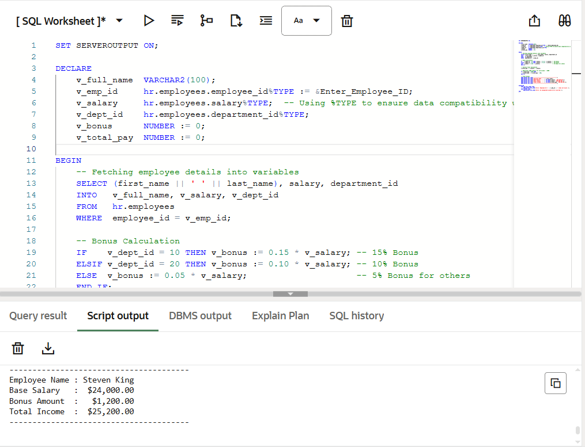

# 💼 PL/SQL Employee Salary Calculator

##  Overview
This project is a simple payroll system built using Oracle PL/SQL.  
It retrieves employee data from the HR schema and calculates:

- Base Salary
- Department-based Bonus
- Total Income
- Extra support for low-income employees

---

##  Features

- **PL/SQL** (Procedures & Exception Handling)
- **SQL** (DML Operations)
- **Database Design** (Relational Integrity)
- **Oracle SQL Developer**
- **Exception handling**
---

##  Technologies Used

- Oracle SQL
- PL/SQL
- HR Schema

  ## Output

  
